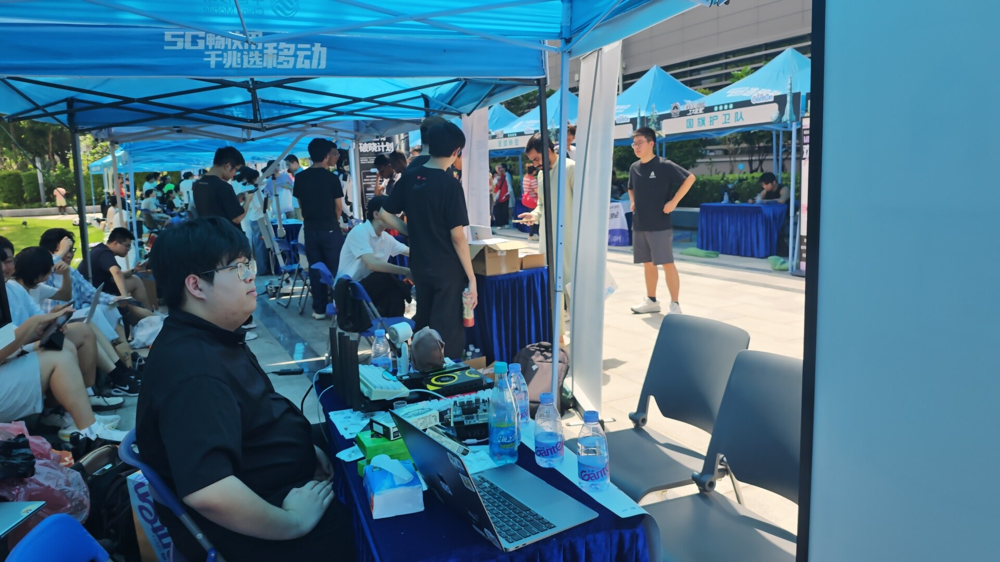
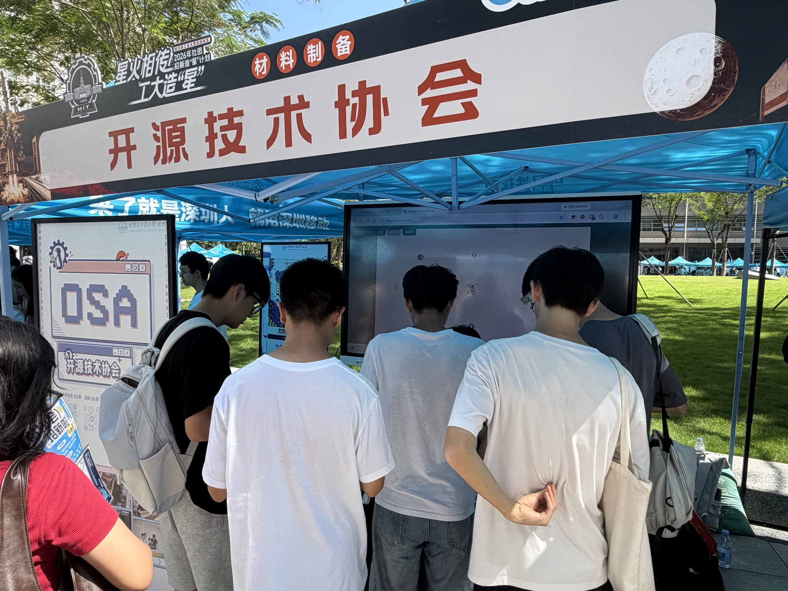
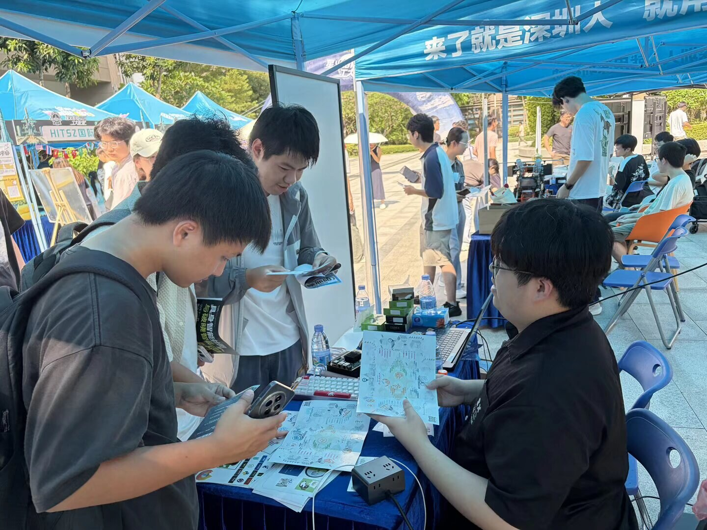
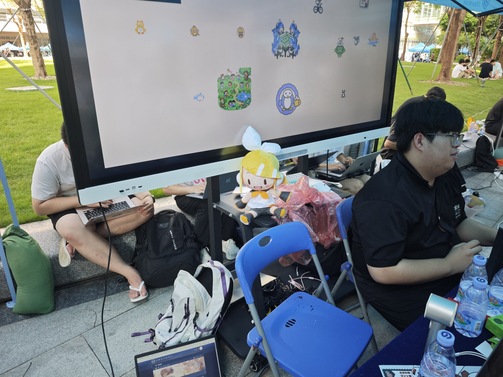
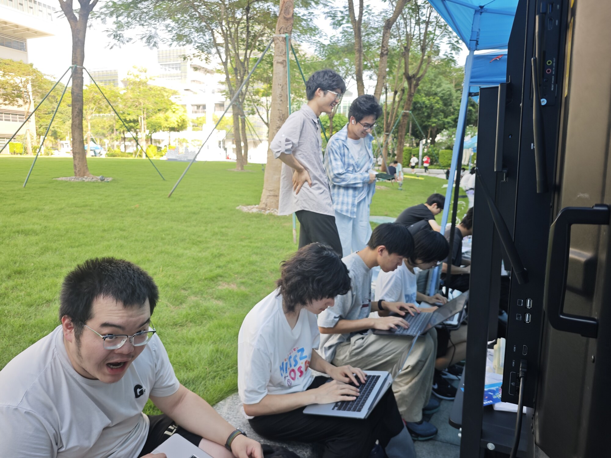
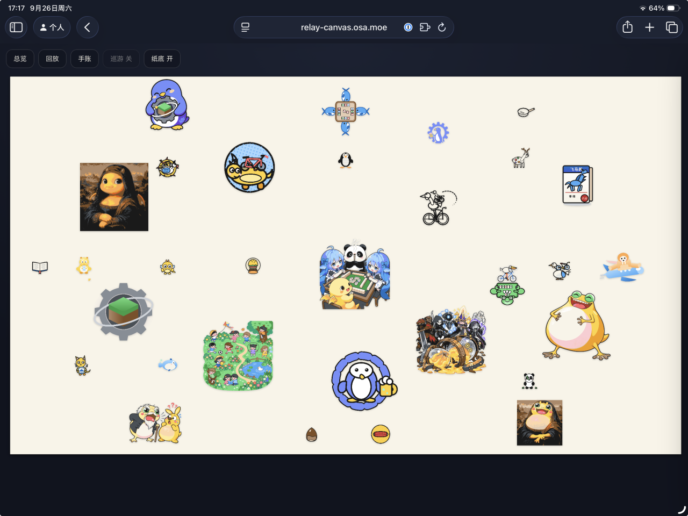
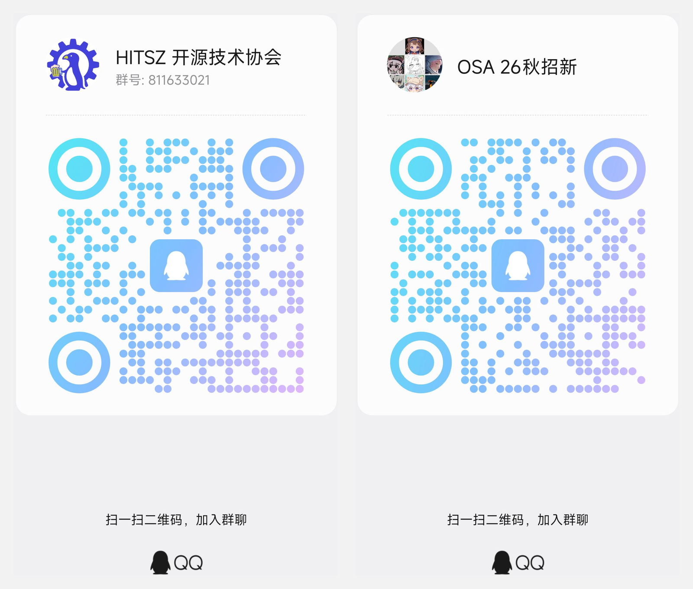
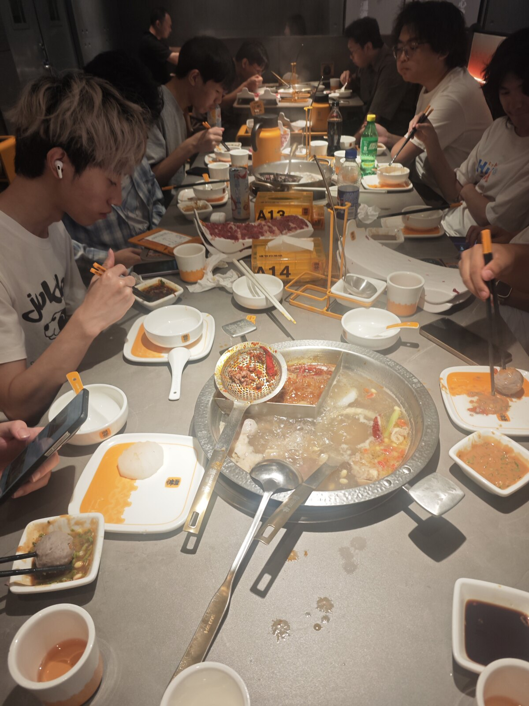
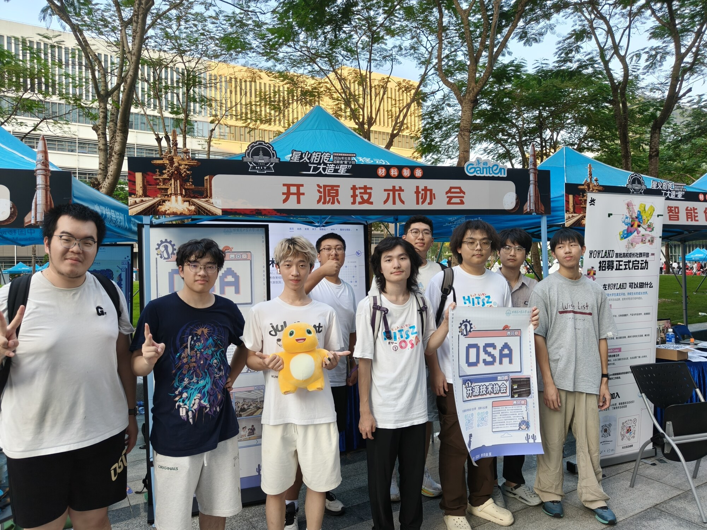

9 月 26 日，开源技术协会如约亮相百团大战，在材料制备区 2 号摊位完成了本学期的线下招新。一天下来，共有**百余位同学**扫码加入了社团讨论群与招新群——感谢每一位在摊位前驻足的同学！

## 摊位上的我们

摊位上，社员们向同学们介绍了社团的基本情况、主营业务与日常活动：从维护校内镜像站、Grader 作业平台、实验指导书平台，到即将开讲的 Linux 101 系列讲座。社员们带来了键盘、路由器、主机、开发板、显卡，为同学们进行现场展示；分发了大量贴纸、钥匙扣等周边，以及免费 Codex 更是供不应求 ~~（在高温下已融化）~~ 。

正在摊位背后写东西的众人：

## 共享画板小游戏：一人一句 prompt

摊位的小游戏是 **Agent 共享画板**：每位同学贡献一句 prompt，交给 agent 接力作画，看看一张图最终会被大家“合谋”成什么样子。大屏前一度围满了排队输入 prompt 的同学。

一天下来，画布上留满了企鹅、奶龙、奶蛙、蒙娜丽莎奶龙、蒙娜丽莎奶娃、奶蛙和大肥鲸与各种奇思妙想。完整画布已永久保存，欢迎前往 [relay-canvas.osa.moe](https://relay-canvas.osa.moe) 查看大家的接力成果。

## 接下来：问卷与 Linux 101

招新并未结束。我们将在**本月末发布招新意向问卷**，随后为预备新人举行零基础友好的 **Linux 101 大型系列讲座**：帮助同学们建立基本认知、探索个人兴趣，现场还有学长带你装系统、装 agent，并免费提供 token 进行实践探索。

社团招新面试将在 Linux 101 讲座结束后进行，预计于 **10 月末或 11 月初**，请留意群内后续通知。

还没进群的同学，欢迎扫码加入招新群与社团讨论大群：

## 收摊之后

盒&饭

## 结语

感谢每一位来到摊位的同学，也感谢从布展到收摊连续奋战一天的社员们。百团大战之后，Linux 101 就是我们的下一场相遇——到时候见！
